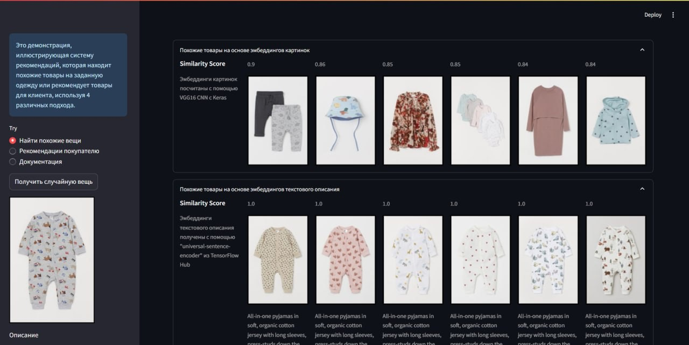
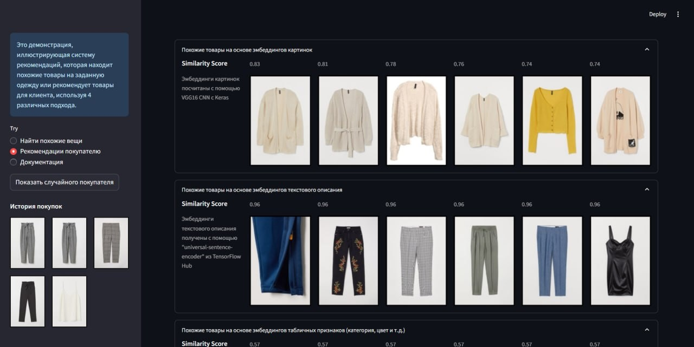

# H&M Recommender System (Content + Collaborative)

  

  <em>Демо интерфейса рекомендательной системы H&M: поиск похожих товаров и персональные рекомендации.</em>

---(results/RM_images)

  

  <em>Режим поиска похожих вещей — рекомендации по фото, описанию и табличным признакам.</em>

Демо рекомендательной системы одежды: поиск **похожих товаров** и **персональные рекомендации покупателю**.  
Используются 4 подхода и их ансамбль:

1. эмбеддинги изображений (CNN VGG16),
2. эмбеддинги текстовых описаний (Universal Sentence Encoder),
3. эмбеддинги табличных фич (категории/цвет и т.д.),
4. коллаборативная фильтрация (TFRS Retrieval),
5. **комбинация эмбеддингов**.

## Демо-приложение

Streamlit UI с двумя режимами:

-   **Найти похожие вещи** — показывает N ближайших товаров по каждому методу и ансамблю.
-   **Рекомендации покупателю** — топ-товары на основе истории покупок.

## Данные

-   Kaggle: _H&M Personalized Fashion Recommendations_.  
    Файлы: `articles.csv`, `customers.csv`, `transactions_train.csv`.
-   В проекте используются предобработанные артефакты в `results/`:
    -   `articles_rcmnds.csv`, `customers_rcmnds.csv`
    -   `results/images/` — превью товаров.

## Модельные подходы

-   **Image embeddings** — VGG16 (Keras), извлечение признаков, поиск ближайших соседей.
-   **Text embeddings** — Universal Sentence Encoder (TF-Hub) по `detail_desc`.
-   **Feature embeddings** — one-hot/категориальные признаки → PCA/проекция в N-мерное пространство.
-   **TFRS Retrieval** — коллаборативная фильтрация (user/item towers).
-   **Ensemble** — конкатенация/взвешивание эмбеддингов для более устойчивого ранжирования.

## Результаты (черновик)

-   Сходимость и устойчивость рекомендаций выросли при комбинировании эмбеддингов.
-   [Добавь сюда конкретную метрику, если посчитаешь: MAP@K / Recall@K.]

## Структура репозитория
